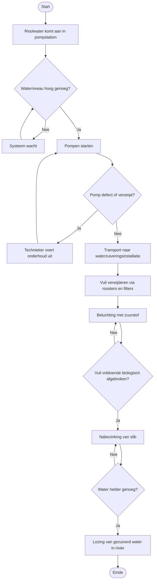

# Business Analysis

## Projectnaam
Aquafin Technieker Platform

---

# 1. Doel van de Analyse

Het doel van deze analyse is het begrijpen van het proces van watertransport en waterzuivering binnen Aquafin. Daarnaast wordt onderzocht hoe techniekers onderhoud uitvoeren en welke ondersteuning een digitale applicatie kan bieden.

Deze analyse vormt de basis voor:
- de risicoanalyse module
- het materiaalbeheer
- de bestelmodule
- de slimme aanbevelingen binnen de applicatie

---

# 2. Beschrijving van het Bedrijfsproces

Aquafin is verantwoordelijk voor het transport en de zuivering van rioolwater in Vlaanderen. Vuil afvalwater wordt via een uitgebreid leidingnet naar waterzuiveringsinstallaties geleid, waar het gereinigd wordt voordat het terug in de natuur terechtkomt.

Technische medewerkers controleren dagelijks:
- pompen en pompstations
- waterniveaus in de collectoren
- leidingen en afvoerbuizen
- filters en roosters
- zuiveringsinstallaties

Daarnaast voeren zij onderhoud uit en lossen zij technische storingen op.

---

# 3. Algemene Procesflow

Het proces start wanneer rioolwater aankomt in een pompstation.

Daarna doorloopt het water verschillende fasen:
1. Detectie van waterniveau
2. Activeren van pompen
3. Transport naar waterzuiveringsinstallatie
4. Verwijderen van afval en vuil via roosters en filters
5. Beluchting met zuurstof voor biologische afbraak
6. Nabezinking van slib
7. Controle van waterkwaliteit
8. Lozing van gezuiverd water in de rivier

---

# 4. Business Process Model

## Mermaid Diagram



---

## Tekstueel Overzicht van het Proces

```text
Start
↓
Rioolwater komt aan in pompstation
↓
Waterniveau controleren
↓
Pompen activeren (of wachten bij laag niveau)
↓
Onderhoud indien pomp defect
↓
Transport naar waterzuiveringsinstallatie
↓
Vuil verwijderen via roosters en filters
↓
Beluchting en biologische afbraak
↓
Nabezinking van slib
↓
Waterkwaliteit controleren
↓
Lozing van gezuiverd water in rivier
↓
Einde
```

---

# 5. Beslissingspunten

Tijdens het proces worden vier kritische controles uitgevoerd.

## 5.1 Waterniveau hoog genoeg?

Wanneer het waterniveau de drempelwaarde bereikt:
- worden pompen automatisch geactiveerd
- wordt het rioolwater naar de installatie getransporteerd

Wanneer het waterniveau te laag is:
- blijft het systeem in wachtstand
- wordt het waterniveau continu bewaakt

---

## 5.2 Pomp defect of verstopt?

Wanneer een pomp niet correct functioneert:
- wordt een technieker ingeschakeld voor onderhoud
- wordt de pomp hersteld of vervangen
- herstart het pompproces

Wanneer de pomp correct werkt:
- wordt het transport opgestart

---

## 5.3 Vuil voldoende afgebroken?

Tijdens de beluchtingsfase wordt zuurstof toegevoegd zodat micro-organismen de resterende vervuiling afbreken.

Wanneer de biologische afbraak nog niet voltooid is:
- blijft het water in de beluchtingsfase circuleren

Wanneer de afbraak voldoende is:
- stroomt het water naar de nabezinkingsfase

---

## 5.4 Water helder genoeg?

Wanneer het water na nabezinking nog te veel zwevende deeltjes bevat:
- blijft het water in de nabezinkingstank

Wanneer de waterkwaliteit voldoet aan de normen:
- wordt het gezuiverde water geloosd in de rivier

---

# 6. Onderhoudsactiviteiten van Techniekers

Technische medewerkers voeren dagelijks en periodiek onderhoud uit.

## Dagelijkse controles
- pompen en motoren controleren
- waterniveaus uitlezen
- alarmmeldingen verwerken

## Periodiek onderhoud
- olie en smeermiddelen vervangen
- verstoppingen verwijderen
- filters reinigen of vervangen
- installaties grondig inspecteren
- mechanische onderdelen vervangen

Hiervoor hebben techniekers dagelijks toegang nodig tot het juiste materiaal en gereedschap.

---

# 7. Problemen en Uitdagingen

Tijdens onderhoudswerken kunnen verschillende problemen optreden:

| Probleem | Gevolg |
|---|---|
| Overstromingsgevaar door hevige neerslag | Noodinterventie vereist |
| Defecte pompen | Verstopping van het systeem |
| Tekort aan materiaal | Vertraagd onderhoud |
| Slechte planning | Inefficiënte inzet van techniekers |
| Onvoldoende risicozicht | Te late reactie op risicosituaties |

Een centrale applicatie biedt een oplossing voor deze uitdagingen door risicoanalyse, materiaalbeheer en bestellingen te integreren.

---

# 8. Relevantie voor de Applicatie

De businessanalyse toont welke functionaliteiten nodig zijn binnen de applicatie.

| Bedrijfsprobleem | Oplossing in de applicatie |
|---|---|
| Geen zicht op overstromingsrisico | Risicoforecast op basis van historische neerslagdata |
| Materiaal niet tijdig beschikbaar | Digitale bestelmodule met leverdatum |
| Moeilijk juiste tools vinden bij hoogwater | Slimme aanbevelingen op basis van risiconiveau |
| Geen centraal materiaalbeheer | Beheerdersmodule voor catalogusbeheer |

---

# 9. Inputs en Outputs

| Input | Verwerking | Output |
|---|---|---|
| KMI-neerslaggegevens (2004–2025) | Seizoensanalyse + trendberekening | Risicoforecast per seizoen |
| Waterniveau pompstation | Drempelcontrole | Activatie pompen |
| Materiaallijst beheerder | CRUD-operaties | Up-to-date catalogus |
| Risiconiveau huidig seizoen | Recommendation Engine | Geprioriteerde flood tools |

---

# 10. Conclusie

De analyse toont dat Aquafin afhankelijk is van een goed georganiseerd proces voor watertransport, zuivering en dagelijks onderhoud. Techniekers spelen hierin een centrale rol en hebben nood aan digitale ondersteuning voor risicoanalyse, materiaalbeheer en bestellingen.

De applicatie ondersteunt deze processen door:
- overstromingsrisico's voorspelbaar en zichtbaar te maken
- materiaalbeheer te digitaliseren en te vereenvoudigen
- onderhoud efficiënter te organiseren via een bestelmodule
- techniekers proactief te ondersteunen met slimme aanbevelingen tijdens risicoperiodes