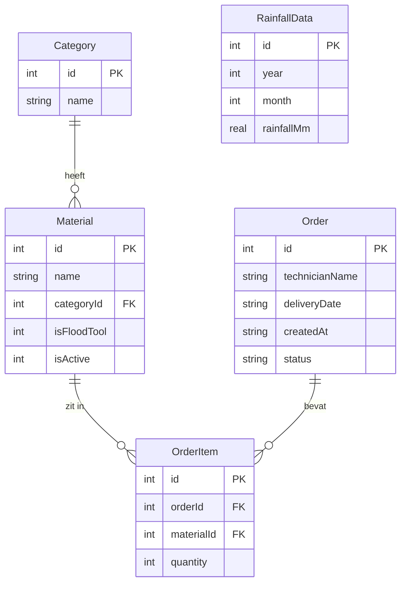

# Data Model

## Projectnaam
Aquafin Technieker Platform

---

# 1. Doel

Dit document beschrijft het datamodel van de applicatie.

Het datamodel bepaalt:
- welke gegevens opgeslagen worden
- hoe gegevens met elkaar verbonden zijn
- welke entiteiten nodig zijn
- welke designkeuzes gemaakt zijn en waarom

---

# 2. Entiteiten Overzicht

De applicatie gebruikt volgende hoofdentiteiten:

| Entiteit | Beschrijving |
|---|---|
| Category | Materiaalcategorieën |
| Material | Beschikbare materialen |
| Order | Geplaatste bestellingen |
| OrderItem | Individuele materiaalregels binnen een bestelling |
| RainfallData | Historische neerslaggegevens (seed data) |
| RiskResults | Tabel aanwezig in database, risico's worden on-the-fly berekend via de Risk Analysis Engine |

> **Opmerking over authenticatie:** Voor dit project wordt geen volledige authenticatie geïmplementeerd. De naam van de technieker wordt als vrij tekstveld opgeslagen bij een bestelling. Reden: de scope van dit project ligt bij risicoanalyse, materiaalbeheer en bestellen, niet bij gebruikersbeheer. Dit is een bewuste, gedocumenteerde vereenvoudiging.

---

# 3. Entity Relationship Diagram

---

# 4. Tabellen

## 4.1 Category

| Veld | Type | Constraints | Beschrijving |
|---|---|---|---|
| id | INTEGER | PRIMARY KEY, AUTOINCREMENT | Unieke identifier |
| name | TEXT | NOT NULL, UNIQUE | Naam van de categorie |

**Seed data categorieën:**
- Bevestigingsmateriaal
- Persoonlijke beschermingsmiddelen
- Gereedschap
- Riolering & Aquafin tools
- Diversen

---

## 4.2 Material

Alle beschikbare materialen in de catalogus.

| Veld | Type | Constraints | Beschrijving |
|---|---|---|---|
| id | INTEGER | PRIMARY KEY, AUTOINCREMENT | Unieke identifier |
| name | TEXT | NOT NULL | Materiaalnaam |
| categoryId | INTEGER | FOREIGN KEY → Category.id | Categorie |
| isFloodTool | INTEGER | DEFAULT 0 (0=nee, 1=ja) | Relevant bij overstromingsrisico |
| isActive | INTEGER | DEFAULT 1 (0=nee, 1=ja) | Beschikbaar in catalogus |

**Flood tools (isFloodTool = 1):**
- Dompelpomp
- Rioolstop
- Slangenwagen
- Gasdetectiemeter
- Hogedrukreiniger
- Ontstoppingsveer

---

## 4.3 Order

Bestellingen geplaatst door techniekers.

| Veld | Type | Constraints | Beschrijving |
|---|---|---|---|
| id | INTEGER | PRIMARY KEY, AUTOINCREMENT | Unieke identifier |
| technicianName | TEXT | NOT NULL | Naam van de technieker |
| deliveryDate | TEXT | NOT NULL | Gewenste leverdatum (ISO 8601 formaat) |
| createdAt | TEXT | DEFAULT CURRENT_TIMESTAMP | Aanmaaktijdstip |
| status | TEXT | DEFAULT 'pending' | Status van de bestelling |

**Mogelijke statussen:**

| Status | Beschrijving |
|---|---|
| pending | Bestelling geplaatst, nog niet verwerkt |
| approved | Bestelling goedgekeurd |
| delivered | Materiaal geleverd |
| cancelled | Bestelling geannuleerd |

---

## 4.4 OrderItem

Individuele materiaalregels binnen een bestelling.

| Veld | Type | Constraints | Beschrijving |
|---|---|---|---|
| id | INTEGER | PRIMARY KEY, AUTOINCREMENT | Unieke identifier |
| orderId | INTEGER | FOREIGN KEY → Order.id | Verwijzing naar bestelling |
| materialId | INTEGER | FOREIGN KEY → Material.id | Verwijzing naar materiaal |
| quantity | INTEGER | NOT NULL, CHECK > 0 | Aantal besteld |

---

## 4.5 RainfallData

Historische neerslaggegevens (2004–2025), ingevoerd als seed data.

| Veld | Type | Constraints | Beschrijving |
|---|---|---|---|
| id | INTEGER | PRIMARY KEY, AUTOINCREMENT | Unieke identifier |
| year | INTEGER | NOT NULL | Jaar van meting |
| month | INTEGER | NOT NULL, CHECK 1–12 | Maand van meting |
| rainfallMm | REAL | NOT NULL | Neerslag in millimeter |

> De gegevens komen rechtstreeks uit de KMI-meetdata die Aquafin aanleverde (2004–2025).

---

# 5. Designkeuzes

## Soft delete voor materialen

Materialen worden niet fysiek verwijderd (`DELETE`), maar gedeactiveerd via `isActive = 0`. Dit beschermt historische ordergegevens die nog naar dat materiaal verwijzen.

## isFloodTool als expliciete markering

Door flood tools expliciet te markeren met een boolean, kan de Recommendation Engine eenvoudig filteren zonder complexe business logic.

## Risicoberekening on-the-fly

Risicoresultaten worden niet opgeslagen in de database maar bij elke API-aanroep berekend door de Risk Analysis Engine op basis van de `rainfallData` tabel. Dit garandeert altijd actuele en consistente resultaten.

## Duplicaatcontrole op actieve materialen

Bij het toevoegen van een materiaal wordt enkel gecontroleerd op duplicaten binnen de actieve materialen (`isActive = 1`). Een gedeactiveerd materiaal met dezelfde naam kan opnieuw worden toegevoegd.

## Geen authenticatie

Gebruikersbeheer en authenticatie vallen buiten de scope van dit project. De naam van de technieker wordt als vrij tekstveld opgeslagen. Dit is een gedocumenteerde vereenvoudiging.

---

# 6. Conclusie

Het datamodel ondersteunt alle kernfunctionaliteiten op een onderhoudbare en uitbreidbare manier. De keuze voor soft deletes, expliciete flood tool markering en on-the-fly risicoberekening maakt de implementatie eenvoudig zonder in te boeten op functionaliteit.